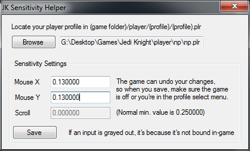

# JK Sensitivity Helper
On modern computers, Jedi Knight / Mysteries of the Sith has an issue with sensitivity where it makes it so that even if you pull the sensitivity slider down to the lowest possible, it's still so sensitive that most people find it unplayable. By editing your profile settings manually though, it's possible to go below the normal minimum sensitivity, and so I made a tool to make that editing a bit easier.

